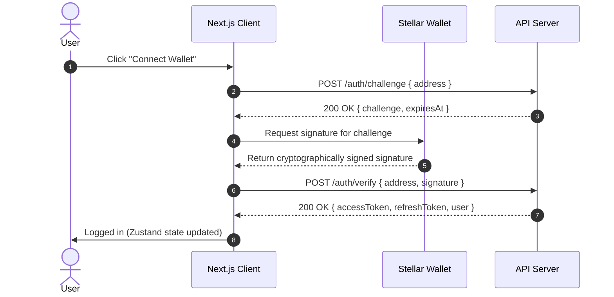

# Lumora Web Application

Lumora is a decentralized fundraising platform built with **Next.js**, **React 19**, **Zustand**, and **TanStack React Query**. It enables users to create, view, and fund campaigns securely using blockchain-based wallet authentication.

---

## 🚀 Getting Started

Follow these steps to configure your local development environment.

### Prerequisites

- **Node.js**: Version `20.0.0` or higher is required (recommended `v20.20.2`).
- **NPM**: Version `10.8.2` or higher (shipped with Node 20).

Check your installed versions before beginning:
```bash
node -v
npm -v
```

### Installation

1. Clone the repository and navigate to the project directory:
   ```bash
   git clone <repository-url>
   cd lumora-web
   ```

2. Standardize your Node.js environment:
   ```bash
   nvm use
   # If Node 20 is not installed, install it:
   # nvm install 20 && nvm use 20
   ```

3. Install project dependencies:
   ```bash
   npm install
   ```

### Local Environment Configuration

Copy the example environment file to create your local variables:
```bash
cp .env.example .env.local
```

Open `.env.local` and define the following variables:

| Variable | Description | Default / Example |
| :--- | :--- | :--- |
| `NEXT_PUBLIC_API_URL` | The base URL of the backend REST API. | `http://localhost:8000` |
| `NEXT_PUBLIC_ENABLE_DEMO_WALLET` | Enables a development-only mock wallet for testing without extension installs. | `true` (dev-only) |

> [!WARNING]
> `NEXT_PUBLIC_ENABLE_DEMO_WALLET` must **always** be set to `false` in production. It is strictly gated and will not execute signature fabrications if `NODE_ENV=production`.

---

## 🔐 Authentication Architecture

Lumora uses **wallet-based authentication** following a challenge-response protocol. This guarantees that only the owner of a Stellar address can log in.

### The Authentication Flow



---

## 🔌 Backend Integration API Specifications

When integrating a new backend with Lumora, the API must implement the following endpoints and response structures.

### 1. Challenge Generation
Generates a random cryptographic challenge string associated with the public address.

- **Endpoint**: `POST /auth/challenge`
- **Content-Type**: `application/json`
- **Request Payload**:
  ```json
  {
    "address": "G..."
  }
  ```
- **Response Payload (200 OK)**:
  ```json
  {
    "challenge": "Sign this random challenge to log in: 9b1deb4d-3b7d-4bad-9bdd-2b0d7b3dcb6d",
    "expiresAt": "2026-08-21T14:05:00.000Z"
  }
  ```

### 2. Signature Verification
Verifies that the signature is cryptographically valid for the given public address and active challenge.

- **Endpoint**: `POST /auth/verify`
- **Content-Type**: `application/json`
- **Request Payload**:
  ```json
  {
    "address": "G...",
    "signature": "base64-encoded-signature-here"
  }
  ```
- **Response Payload (200 OK)**:
  ```json
  {
    "accessToken": "eyJhbGciOi...",
    "refreshToken": "eyJhbGciOi...",
    "user": {
      "id": "usr-12345",
      "email": "user@example.com",
      "name": "Alex Creator",
      "walletAddress": "G..."
    }
  }
  ```

### 3. Token Rotation / Refresh
Swaps a refresh token for a brand-new access and refresh token pair.

- **Endpoint**: `POST /auth/refresh`
- **Content-Type**: `application/json`
- **Request Payload**:
  ```json
  {
    "refreshToken": "eyJhbGciOi..."
  }
  ```
- **Response Payload (200 OK)**:
  ```json
  {
    "accessToken": "eyJhbGciOi...",
    "refreshToken": "eyJhbGciOi..."
  }
  ```

### 4. Logout / Revocation
Instructs the server to blacklist or revoke the active refresh token.

- **Endpoint**: `POST /auth/logout`
- **Content-Type**: `application/json`
- **Headers**: `Authorization: Bearer <accessToken>`
- **Response Payload (200 OK)**:
  ```json
  {
    "success": true,
    "message": "Logged out successfully"
  }
  ```

---

## 🛠️ Local Development & Operations

### Run the Development Server
Starts the Next.js development server with hot-reloading:
```bash
npm run dev
```
Open [http://localhost:3000](http://localhost:3000) to view the application.

### Code Quality & Linting
Run ESLint to check for stylistic issues, syntax, or React hooks bugs:
```bash
npm run lint
```

To automatically fix fixable lint problems:

```bash
npm run lint:fix
```

Run TypeScript-only checks (no emit):

```bash
npm run typecheck
```

### Run Unit and Integration Tests
We use **Vitest** for unit testing:
```bash
npm run test
```

Run tests in watch mode during development:

```bash
npm run test:watch
```

### Production Build & Deployment
To test compilation and optimize the assets:
```bash
# 1. Build the production build
npm run build

# 2. Run the production build locally
npm run start
```

---

## ⚠️ Security & Environment Assumptions

### 1. Developer-Only Demo Wallets
- **Fabricated Signatures**: When `NEXT_PUBLIC_ENABLE_DEMO_WALLET` is `true`, the frontend skips connecting to the Stellar extension and returns a fixed mock signature.
- **Production Gating**: The demo option is strictly bypassed if `NODE_ENV=production`. If you attempt to connect without a wallet in production, the app falls back to a browser-source error notifying the user that no wallet extension is available.
- **Visual Badges**: Active mock sessions are visibly badged as **Demo** in the navbar to prevent developers from confusing mock environments with mainnet transactions.

### 2. Challenge/Nonce Expiration & Replay Attacks
- **Expiration Gating**: Challenges generated via `/auth/challenge` must expire in 5 minutes or less (`expiresAt`).
- **One-Time Nonces**: Nonces must be tracked in the backend database. A nonce must be deleted immediately after it is verified (regardless of success or failure) to prevent replay attacks where an attacker sniffs a signature and tries to re-authenticate.

### 3. Session Safety & Token Rotation
- **Token Rotation (RTR)**: Upon every token refresh, the old refresh token is immediately blacklisted. If a client attempts to use a blacklisted token, the backend treats this as a theft event and invalidates all session tokens associated with that user.
- **Deduplicated Re-Auth**: When concurrent API requests fail with 401s, Axios interceptors queue subsequent requests and trigger a single re-auth modal to connect again.
- **Cross-Tab Consistency**: `providers.tsx` checks for session validity on window focus or storage events. If you log out or disconnect on one tab, other open tabs immediately clear their local storage and redirect to the landing page.
- **Clear Logout**: Logging out triggers token invalidation on the backend and purges cookies, memory state, and localStorage values on the client.

---

## 📐 Data and State Architecture

- **Server State (TanStack React Query)**: Controls API calls, query caching, error states, and pagination. Query keys are centralized in `src/lib/queryKeys.ts` to ensure cache synchronization.
- **Client UI State (Zustand)**: Manages modal visibility, themes, UI filters, and the current active wallet session. Do **not** duplicate React Query collections into Zustand, as this creates competing sources of truth and stale UI bugs.

---

## 🧩 Environment Variables (required)

Create a local environment file from the example and set the API URL before starting the app:

```bash
cp .env.example .env.local
# Edit .env.local and set:
# NEXT_PUBLIC_API_URL=http://localhost:8000
# NEXT_PUBLIC_ENABLE_DEMO_WALLET=true # dev-only
```

- `NEXT_PUBLIC_API_URL`: Base URL of the backend REST API (required).
- `NEXT_PUBLIC_ENABLE_DEMO_WALLET`: When `true` enables a development-only demo wallet (never enable in production).

## ⚙️ Supported Runtimes & Package Managers

You can run the project with any of the following commands depending on your package manager:

```bash
# npm
npm install
npm run dev

# yarn
yarn
yarn dev

# pnpm
pnpm install
pnpm dev

# bun
bun install
bun dev
```

## 📦 Key Dependency Versions

- `next`: 16.2.10
- `react`: 19.2.4
- `@tanstack/react-query`: ^5.101.2
- `zustand`: ^5.0.14
- `axios`: ^1.18.1

These are the versions used in `package.json` and reflected in the TypeScript and ESLint configs.

## 🔁 Backend API Examples (curl)

The frontend expects the following endpoints. These examples show minimal payloads and the expected success responses.

1) Request a challenge

```bash
curl -X POST "$NEXT_PUBLIC_API_URL/auth/challenge" \
  -H "Content-Type: application/json" \
  -d '{"address":"G..."}'
```

Success response (200):

```json
{
  "challenge": "Sign this random challenge to log in: ...",
  "expiresAt": "2026-08-21T14:05:00.000Z"
}
```

2) Verify a signature

```bash
curl -X POST "$NEXT_PUBLIC_API_URL/auth/verify" \
  -H "Content-Type: application/json" \
  -d '{"address":"G...","signature":"base64-signature"}'
```

Success response (200):

```json
{
  "accessToken": "eyJhbGciOi...",
  "refreshToken": "eyJhbGciOi...",
  "user": { "id":"usr-123","walletAddress":"G..." }
}
```

3) Refresh tokens (rotation)

```bash
curl -X POST "$NEXT_PUBLIC_API_URL/auth/refresh" \
  -H "Content-Type: application/json" \
  -d '{"refreshToken":"eyJ..."}'
```

Success response (200):

```json
{
  "accessToken": "eyJhbGciOi...",
  "refreshToken": "eyJhbGciOi..."
}
```

4) Logout / revoke

```bash
curl -X POST "$NEXT_PUBLIC_API_URL/auth/logout" \
  -H "Content-Type: application/json" \
  -H "Authorization: Bearer <accessToken>"
```

Success response (200):

```json
{ "success": true, "message": "Logged out successfully" }
```

## ✅ How to validate the wallet auth flow locally

- Start the backend on `http://localhost:8000` (or set `NEXT_PUBLIC_API_URL` accordingly).
- Start the frontend (`npm run dev`).
- Open the browser, click **Connect Wallet** and follow the prompt. If using the demo wallet set `NEXT_PUBLIC_ENABLE_DEMO_WALLET=true` in `.env.local` (dev only).
- On successful verify the frontend will receive `accessToken` and `refreshToken`, persist them in localStorage`, and update Zustand `authStore`.

## 🔒 Security & Best Practices (summary)

- Never enable the demo wallet in production.
- Backend must enforce challenge expiration (<= 5 minutes) and make nonces one-time use.
- Implement refresh-token rotation (issue new refresh token on every `/auth/refresh` and blacklist the old one).
- Treat reuse of a rotated refresh token as a theft event and invalidate the session.

### Detailed Security Notes

- **Demo wallet risks**: The demo wallet fabricates signatures and bypasses user-controlled key material. Use it only in local development. Never allow demo signatures against any production backend. Clearly badge demo sessions in the UI and require an opt-in environment flag (`NEXT_PUBLIC_ENABLE_DEMO_WALLET=true`) that is ignored when `NODE_ENV=production`.

- **Nonce (challenge) handling & replay protection**:
  - Challenges should be single-use values stored server-side and removed after first verification attempt (success or failure).
  - Set `expiresAt` to a short window (recommended 5 minutes or less) and reject expired challenges.
  - Log and monitor repeated attempts for the same nonce as a possible replay/attack.

- **Refresh-token rotation**:
  - On successful `/auth/refresh` issue a new refresh token and invalidate the previous one immediately.
  - Maintain a short rotation window and optionally keep a sequence counter or previous-token reference so the server can detect reuse (the client mirrors this via `applyRefreshRotation`).
  - Treat reuse of an already-rotated token as a theft event: revoke all tokens and require a full re-authentication.

- **Concurrent 401 handling**:
  - The client queues concurrent requests that fail with 401 and allows a single refresh attempt. If refresh fails, queued requests should fail and the user must re-authenticate.

- **Cross-tab & storage safety**:
  - Use storage events and cookie checks to keep multiple tabs in sync. If a logout is detected in another tab, clear localStorage and reset Zustand state.
  - Prefer HttpOnly cookies for access tokens where possible; if using localStorage for tokens, be explicit in the README about XSS risks and audit third-party scripts.

- **Clear logout & token blacklisting**:
  - On logout call `/auth/logout` to revoke the current refresh token server-side and clear client-side persisted state.
  - Mark the refresh token as used/blacklisted client-side before purging storage so the backend can detect immediate reuse attempts.

- **Error handling and user feedback**:
  - Map raw backend and wallet errors to short, actionable messages. Avoid leaking stack traces or detailed error codes in the UI.

### Backend Checklist for Integrators

- `POST /auth/challenge`: generate and persist a one-time challenge with `expiresAt`.
- `POST /auth/verify`: validate signature, issue `accessToken` and `refreshToken`, and remove the challenge record.
- `POST /auth/refresh`: verify refresh token, issue new `accessToken` and `refreshToken`, blacklist old refresh token.
- `POST /auth/logout`: revoke the provided refresh token and clear server-side sessions.

Follow these rules to interoperate correctly with Lumora's client-side assumptions (token rotation, 401 deduping, and demo-wallet gating).

## 🧭 Where to look in the code

- API helpers and token rotation: `src/lib/api.ts`
- Auth and token storage: `src/stores/authStore.ts`
- Re-auth modal and cross-tab logic: `src/app/providers.tsx` and `src/components/ReAuthModal.tsx`

---

If you want, I can now add explicit `curl` examples to `src/lib/api.ts` comments or update `src/app/layout.tsx` metadata to include the runtime versions. Which would you prefer next?
